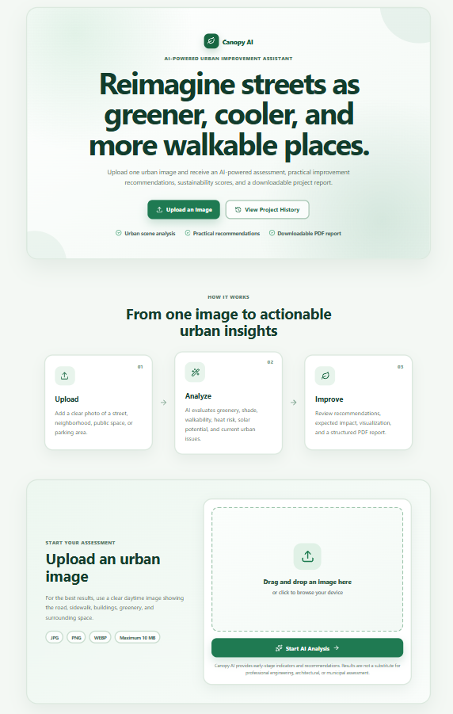
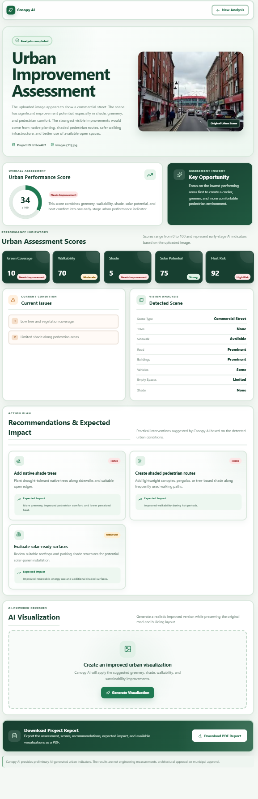
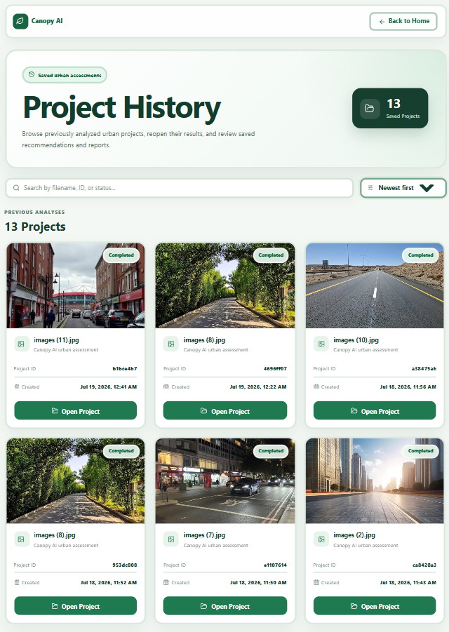
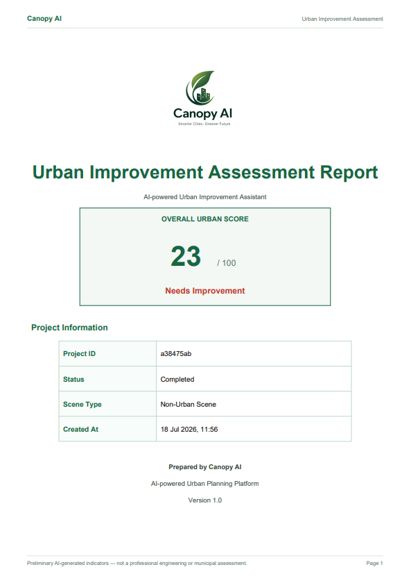
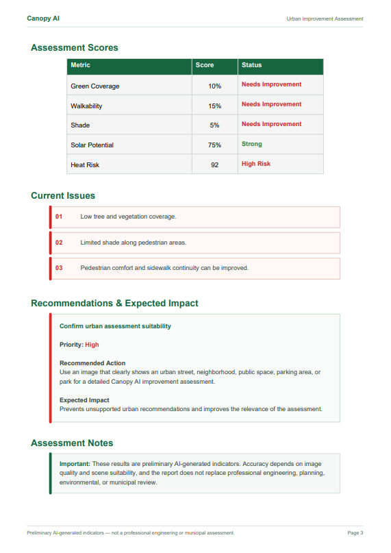

# 🌳 Canopy AI

<p align="center">
  <strong>AI-powered Urban Improvement Assistant</strong><br>
  Transform urban images into actionable sustainability insights using AI.
</p>

<p align="center">


</p>

---

# 📖 Overview

**Canopy AI** is an AI-powered urban assessment platform that analyzes streets, neighborhoods, parks, parking areas, and public spaces from a single image.

The platform combines computer vision, urban assessment, sustainability indicators, recommendation generation, visualization, and automated reporting into one workflow.

Instead of requiring field inspections and lengthy expert reviews, Canopy AI provides an initial urban assessment in seconds.

Users simply upload an urban image and receive:

- AI-powered urban scene analysis
- Sustainability indicators
- Urban issues detection
- Practical recommendations
- AI-generated visualization
- Professional PDF report
- Saved project history

Canopy AI is intended as an early-stage decision-support tool for municipalities, architects, urban planners, researchers, students, and consulting companies.

---

# Demo:
https://drive.google.com/drive/folders/1-aYg7g4eNXsnGHDuWsJ28tSzbx0i9jbw?usp=sharing


# ❗ Problem Statement

Urban environment evaluation traditionally requires:

- Site visits
- GIS tools
- Professional planners
- Manual documentation
- Long review cycles

These processes require significant time and resources, making rapid urban assessment difficult.

Canopy AI accelerates the first stage of urban planning by automatically extracting meaningful urban indicators from a single image.

> **Disclaimer**
>
> Canopy AI provides preliminary AI-generated indicators intended for early-stage planning. Results should support—not replace—professional engineering, architectural, or municipal review.

---

# ✨ Features

- Upload urban street images
- AI-powered scene understanding
- Automatic urban object detection
- Sustainability assessment
- Green Coverage estimation
- Walkability evaluation
- Shade assessment
- Solar Potential estimation
- Heat Risk estimation
- Executive summary generation
- Current issue detection
- Urban improvement recommendations
- Expected impact generation
- AI visualization prompt generation
- AI-generated urban redesign (when available)
- Professional PDF report
- SQLite project storage
- Project history
- REST API

---

# 🤖 AI Workflow

```text
                Upload Urban Image
                         │
                         ▼
                React Frontend
                         │
                         ▼
                 FastAPI Backend
                         │
                         ▼
                  Vision Agent
                         │
                         ▼
              Urban Scene Analysis
                         │
                         ▼
            Sustainability Assessment
                         │
                         ▼
             Recommendation Generation
                         │
            ┌────────────┴────────────┐
            ▼                         ▼
 Visualization Prompt          SQLite Database
            │                         │
            ▼                         │
 Image Generation Service             │
            │                         │
            └────────────┬────────────┘
                         ▼
               PDF Report Generation
                         │
                         ▼
                 Results & History
```

---

# 🏗 System Architecture

```text
                               User
                                 │
                                 ▼
                        React Frontend (Vite)
                                 │
                                 ▼
                          FastAPI Backend
                                 │
        ┌────────────────────────┼────────────────────────┐
        ▼                        ▼                        ▼
  Vision Agent            Analysis Service        SQLite Database
        │                        │                        ▲
        ▼                        ▼                        │
 Urban Scene             Urban Assessment                │
 Understanding            & Recommendations              │
        │                        │                        │
        └──────────────┬─────────┘                        │
                       ▼                                  │
              Visualization Agent                         │
                       │                                  │
                       ▼                                  │
            Image Generation Service                      │
                       │                                  │
                       ▼                                  │
                Report Generation Service ────────────────┘
                       │
                       ▼
             PDF Report + Project History
```

## Core Components

| Component | Responsibility |
|----------|----------------|
| React Frontend | Uploads images and displays results |
| FastAPI Backend | Coordinates requests and business logic |
| Vision Agent | Understands the uploaded urban image |
| Analysis Service | Produces sustainability indicators and recommendations |
| Visualization Agent | Creates prompts for image generation |
| Image Generation Service | Generates an improved urban visualization |
| Report Service | Creates the PDF report |
| SQLite Database | Stores project history and analysis results |

---

# 🧠 AI Components

## Vision Agent

The Vision Agent analyzes the uploaded image using Google Gemini Vision.

It identifies:

- Scene type
- Buildings
- Roads
- Sidewalks
- Trees
- Vehicles
- Empty spaces
- Shade level

The agent avoids inventing measurements when they cannot be confidently inferred.

---

## Analysis Service

The Analysis Service converts the detected scene into meaningful urban insights.

It generates:

- Sustainability indicators
- Urban issues
- Executive summary
- Recommendations
- Expected impact
- Recommendation priorities

Unlike traditional multi-agent systems, this logic is implemented as a backend service rather than a separate autonomous agent.

---

## Visualization Agent

The Visualization Agent transforms the analysis into a detailed urban redesign prompt.

The generated prompt preserves the existing layout while suggesting realistic improvements such as:

- Native trees
- Shaded sidewalks
- Benches
- Solar panels
- Green landscaping
- Safer pedestrian areas

The prompt is then passed to the configured image-generation model.
---

## Image Generation Service

The Image Generation Service attempts to generate an improved version of the uploaded urban scene while preserving the original road layout and buildings.

Depending on the generated prompt, the visualization may include:

- Native trees
- Green landscaping
- Solar panels
- Benches
- Improved pedestrian crossings
- Shaded sidewalks
- Better public spaces

Image generation depends on the configured AI model and available API access.

---

## Report Service

The Report Service combines all project data into a professional PDF report.

The report includes:

- Project information
- Overall urban score
- Sustainability indicators
- Executive summary
- Current issues
- Recommendations
- Assessment notes
- Original image

Unlike the Vision Agent, the Report Service is deterministic and is not implemented as an autonomous AI agent.

---

# 📊 Analysis Output

Each project produces the following outputs.

## Scene Information

- Scene Type
- Trees
- Buildings
- Roads
- Sidewalks
- Vehicles
- Empty Spaces
- Shade Level

## Sustainability Indicators

- Green Coverage
- Walkability
- Shade
- Solar Potential
- Heat Risk

## AI Insights

- Executive Summary
- Current Issues
- Practical Recommendations
- Expected Impact
- Recommendation Priorities
- Visualization Prompt

## Generated Assets

- Improved Urban Visualization (when available)
- Professional PDF Report

> Sustainability indicators are preliminary AI-generated estimates and should not be interpreted as engineering measurements.

---

# 📄 PDF Report

The generated PDF report includes:

- Cover Page
- Canopy AI Branding
- Overall Urban Score
- Project Information
- Original Urban Image
- Executive Summary
- Assessment Scores
- Current Issues
- Recommendations
- Assessment Notes
- Report Generation Date
- Page Numbers

Reports can be regenerated later from saved project data.

---

# 🖼 Screenshots

## Home



## Analysis Results



## Project History



## PDF Report





---

# 🛠 Tech Stack

| Layer | Technology |
|--------|------------|
| Frontend | React + Vite |
| Backend | FastAPI |
| Language | Python |
| Database | SQLite |
| ORM | SQLAlchemy |
| AI Vision | Google Gemini |
| Image Processing | Pillow |
| PDF Reports | ReportLab |
| API | RESTful API |

---

# 📂 Project Structure

```text
canopy-ai/

├── backend/
│
│   ├── app/
│   │
│   ├── agents/
│   │     ├── vision_agent.py
│   │     └── visualization_agent.py
│   │
│   ├── database/
│   │     ├── base.py
│   │     └── session.py
│   │
│   ├── models/
│   │     └── project.py
│   │
│   ├── routes/
│   │     └── projects.py
│   │
│   ├── schemas/
│   │     └── vision.py
│   │
│   ├── services/
│   │     ├── analysis_service.py
│   │     ├── image_generation_service.py
│   │     ├── report_service.py
│   │     ├── vision_service.py
│   │     └── visualization_agent.py
│   │
│   └── main.py
│
├── uploads/
├── generated/
├── reports/
├── assets/
├── canopy.db
│
├── frontend/
│
│   ├── src/
│   │
│   ├── components/
│   ├── pages/
│   ├── services/
│   ├── App.jsx
│   ├── main.jsx
│   └── styles.css
│
└── README.md
```

---

# 🗄 Database

Canopy AI uses SQLite to persist all projects.

Each project stores:

- Project ID
- Uploaded image
- Analysis results
- Visualization status
- Generated image path
- Report information
- Creation date

Project persistence allows users to:

- View previous projects
- Regenerate reports
- Reopen analyses
- Access project history

---

# 📡 API Endpoints

| Method | Endpoint | Description |
|---------|----------|-------------|
| GET | `/api/health` | Health check |
| POST | `/api/projects` | Upload an image and create a project |
| GET | `/api/projects` | List all projects |
| GET | `/api/projects/{id}` | Retrieve a project |
| POST | `/api/projects/{id}/visualization` | Generate an improved visualization |
| GET | `/api/projects/{id}/report` | Generate and download the PDF report |

---

# 🚀 Installation

## Requirements

Install the following before running the project:

- Python 3.x
- Node.js
- npm
- Git
- Google Gemini API Key

---

## Clone the Repository

```bash
git clone https://github.com/maysamma/canopy-ai.git

cd canopy-ai
```

---

## Backend Setup

Navigate to the backend folder:

```bash
cd backend
```

Create a virtual environment:

```bash
python -m venv .venv
```

Activate the environment.

### Windows

```powershell
.venv\Scripts\Activate.ps1
```

Install the required packages:

```bash
pip install -r requirements.txt
```

Run the backend server:

```bash
uvicorn app.main:app --reload
```

Backend URL

```text
http://127.0.0.1:8000
```

Swagger Documentation

```text
http://127.0.0.1:8000/docs
```

---

## Frontend Setup

Open another terminal.

```bash
cd frontend
```

Install dependencies:

```bash
npm install
```

Run the development server:

```bash
npm run dev
```

Frontend URL

```text
http://localhost:5173
```

---

# ⚙ Environment Variables

Create

```text
backend/.env
```

Example

```env
GEMINI_API_KEY=YOUR_API_KEY

GEMINI_MODEL=gemini-2.5-flash

GEMINI_IMAGE_MODEL=gemini-3.1-flash-image
```

| Variable | Description |
|----------|-------------|
| GEMINI_API_KEY | Google Gemini API Key |
| GEMINI_MODEL | Vision analysis model |
| GEMINI_IMAGE_MODEL | Image generation model |

> Never commit your `.env` file or expose your API key.

---

# 🖼 AI Visualization

Image generation depends on:

- The configured Gemini image model
- Available API quota
- Regional model availability

If visualization is unavailable, Canopy AI still provides:

- Complete scene analysis
- Sustainability indicators
- Executive summary
- Current issues
- Urban recommendations
- Visualization prompt
- Professional PDF report
- Project history

---

# 🧪 Running the Application

1. Start the backend.
2. Start the frontend.
3. Open:

```text
http://localhost:5173
```

4. Upload an urban image.
5. Wait for the AI analysis.
6. Review the recommendations.
7. Generate a visualization (if available).
8. Download the PDF report.
9. Open **Project History** to access previous analyses.

Supported image formats:

- JPG
- PNG
- WebP

Maximum upload size:

```text
10 MB
```

---

# 🔒 Current Limitations

Current version limitations:

- Single-image analysis only
- Preliminary AI indicators
- Image quality affects accuracy
- No GIS integration
- No cost estimation
- Image generation depends on API availability
- Does not replace professional urban planning review

---

# 🗺 Roadmap

### ✅ Completed

- Urban image upload
- AI-powered scene analysis
- Sustainability assessment
- Urban recommendations
- AI visualization
- Professional PDF reports
- SQLite project persistence
- Project history
- RESTful API

### 🚧 Next

- Cloud deployment
- User authentication

---

# 🔮 Future Improvements

Canopy AI is designed to be easily extensible.

Future versions may include:

- GIS integration
- Google Street View support
- Video-based urban analysis
- Interactive dashboards
- Multi-language reports
- Cost estimation for recommendations
- Native tree recommendations by city
- Urban heat simulation
- Before-and-after comparison tools
- Neighborhood-scale analysis
- Cloud storage
- Collaboration features
- Municipal system integration

---

# 🎯 Target Users

Canopy AI is intended for:

- Municipalities
- Urban planners
- Architects
- Landscape architects
- Real-estate developers
- Engineering consultants
- Sustainability consultants
- Researchers
- University students
- Smart city initiatives

---

# 🌍 Expected Impact

Canopy AI enables faster and more accessible urban assessments by transforming a single street image into meaningful planning insights.

The platform helps users:

- Identify urban sustainability challenges
- Improve walkability and pedestrian comfort
- Evaluate greenery and shade coverage
- Detect potential heat-risk areas
- Generate realistic urban improvement ideas
- Produce professional reports for presentations
- Support early-stage planning and decision making

Rather than replacing professional urban studies, Canopy AI serves as an AI-powered decision-support platform that accelerates the initial assessment process.

---

# 💡 Why Canopy AI?

Unlike traditional urban assessment workflows that rely on multiple manual steps and expert reviews, Canopy AI combines:

- Computer Vision
- AI Reasoning
- Sustainability Assessment
- Recommendation Generation
- Urban Visualization
- Automated Reporting

into one streamlined workflow.

The result is a faster, more accessible, and more intuitive urban analysis experience.

---

## License

This project is released under the MIT License.

# Google Drive Link:
https://drive.google.com/drive/folders/1IaM4pUQGd43LJsSbM2Adn0xY25WOVP6O?usp=sharing

# 👤 Author

**Maysam Abduljalil**

- Email: maysamabduljalil@gmail.com
- GitHub: https://github.com/maysamma
- LinkedIn: https://www.linkedin.com/in/maysam-m-abduljalil


---

<p align="center">

Made with ❤️ using FastAPI, React, Google Gemini, and SQLite.

</p>

---

© 2026 Canopy AI